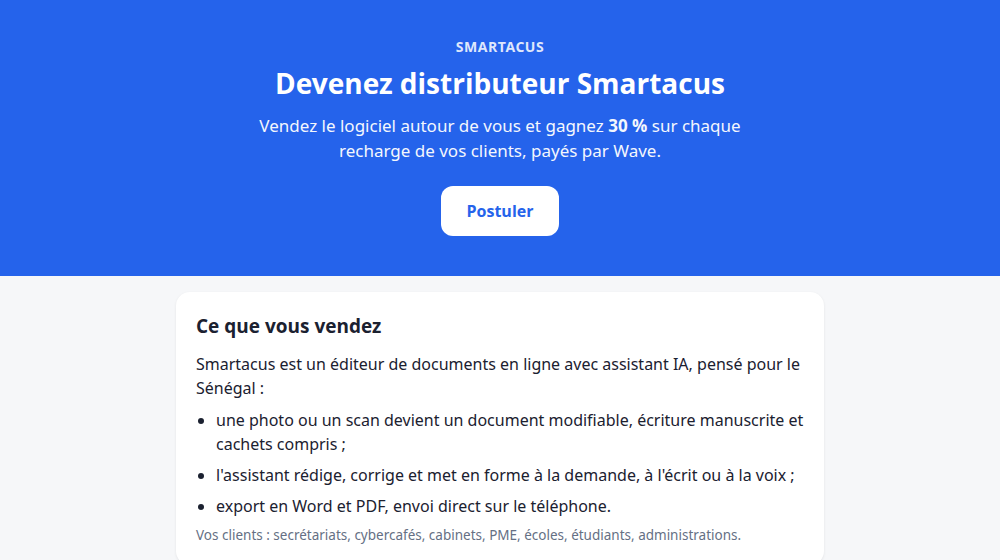
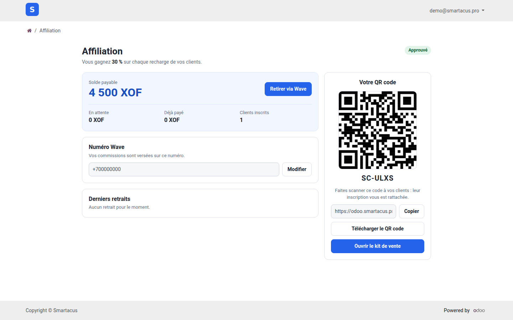
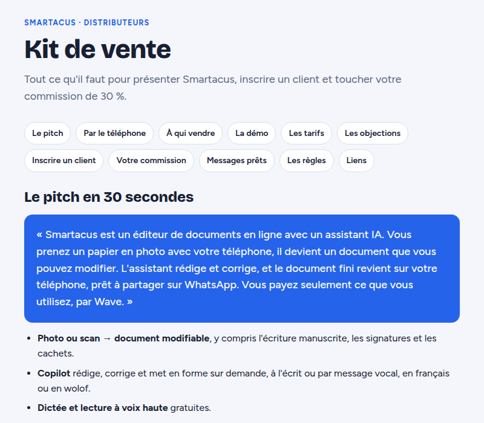

import Clip from "../../../components/Clip.astro";

Do you know people, businesses or public services that would benefit from the
editor? Become a **reseller** (affiliate): you earn a commission on **every
credit top-up** by the customers you refer, paid into your **Wave** account.
The current rate is shown on the
[Devenir distributeur](https://odoo.smartacus.pro/affiliation) page.

## B.1 Become a reseller

Two paths lead to the same request.

### Without an account: the application page

1. Open [odoo.smartacus.pro/affiliation](https://odoo.smartacus.pro/affiliation).
   The page presents the software, your earnings and the steps.
2. Under **Postuler** (Apply), enter your **name**, your **e-mail**, your
   **Wave number**, your city or neighbourhood and how you plan to sell.
3. Click **Envoyer ma demande** (Send my request).

### With an account: from the editor

1. Open **Mon compte**: the **Affiliation** card offers **Vendre ce
   logiciel** (Sell this software).
2. Explain your approach in a few words (who you plan to help, and how).
3. Enter the **Wave number** that will receive your commissions, if it isn't
   saved yet.
4. Click **Envoyer** (Send): your request becomes **En attente** (Pending).

<Clip src="en/bonus-1-devenir-affilie.mp4" voice caption="Sending an affiliation request (French voice-over: play it with sound on)" />

The Smartacus team reviews your request and lets you know by e-mail as soon as
it is approved. If you applied without an account, that e-mail also contains
your login details.

## B.2 Your affiliate area

Once you're approved, **Mon compte** shows your **Solde parrainage** (referral
balance). Click **Voir** (View) to open your affiliate area, also available at
[odoo.smartacus.pro/my/affiliation](https://odoo.smartacus.pro/my/affiliation).

- On the left: your **payable balance**, **pending** commissions, the total
  **already paid**, the number of **registered customers**, your Wave number
  and your latest withdrawals.
- On the right: your **QR code**, your personal code, your **referral link**
  and the **sales kit**.

## B.3 Sign up a customer

People who create their account **through your link or your QR code** become
your referrals. **Every time** one of them tops up credits, you receive your
percentage of the amount.

- **Face to face**: click the **QR code** to show it full screen and have the
  customer scan it. A click, the **Fermer** (Close) button or the Escape key
  closes it.
- **Remotely**: click **Copier** (Copy), then send your link (WhatsApp,
  e-mail, social media…).
- **On paper**: **Télécharger le QR code** (Download the QR code) saves the
  image so you can print it.

:::tip[Link first]
The referral is recorded when the account is created: ask the people you
refer to open your link or scan your QR code **before** signing up, otherwise
the account won't be linked to you.
:::

## B.4 The sales kit

The **Ouvrir le kit de vente** (Open the sales kit) button leads to
[odoo.smartacus.pro/affiliation/kit](https://odoo.smartacus.pro/affiliation/kit):
the pitch, the customers to target, a three-minute demo, the pricing, answers
to objections and ready-to-copy messages. The kit is in French.

If you are logged in, **your personal link is already inserted** in the
messages and your QR code appears in the "Inscrire un client" section.

## B.5 Withdraw your commissions via Wave

Depending on the current setting, a commission may stay **pending** for a few
days, while the top-up is validated, before it becomes **payable** and is
added to your **payable balance**.

1. In your affiliate area, check your Wave number (the **Modifier** button to
   change it, then **Enregistrer** — Save).
2. Click **Retirer via Wave** (Withdraw via Wave) and enter the amount.
3. Click **Confirmer le retrait** (Confirm withdrawal): the amount is sent to
   your Wave account.

<Clip src="en/bonus-2-espace-affilie.mp4" voice caption="The affiliate area: balance, QR code, referral link, sales kit and withdrawal (French voice-over; withdrawal cancelled in the demo)" />

A **minimum balance** is required to withdraw: until it is reached, the
affiliate area tells you. Your latest withdrawals are shown with their date
and status: **En cours** (In progress), **Payé** (Paid) or **Échoué**
(Failed). A failed withdrawal isn't lost: the amount stays in your balance.
