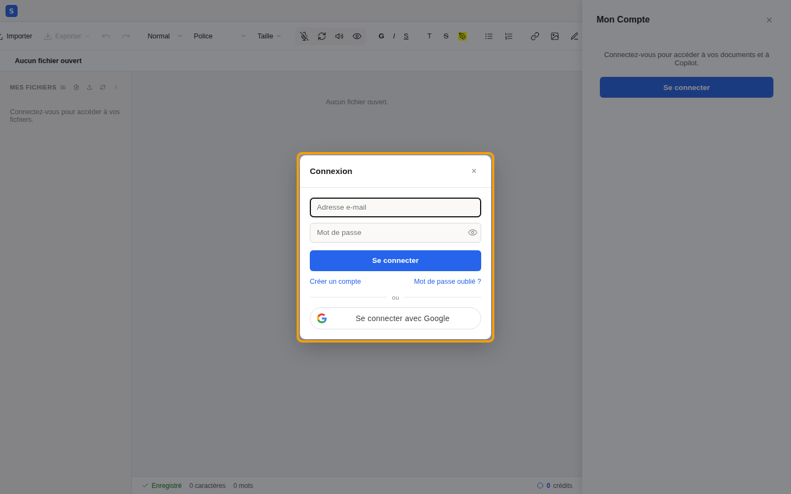
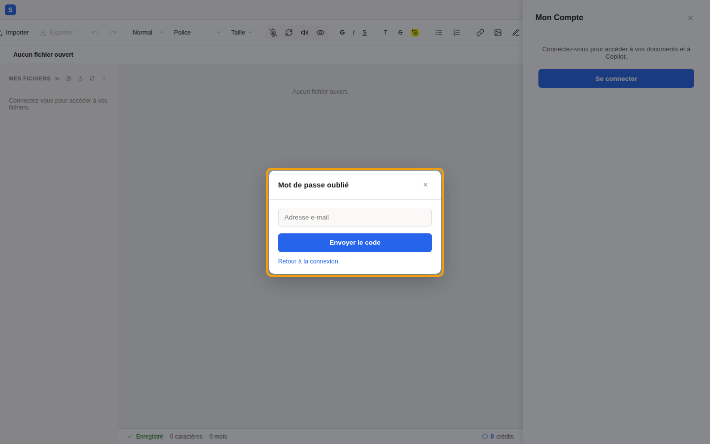
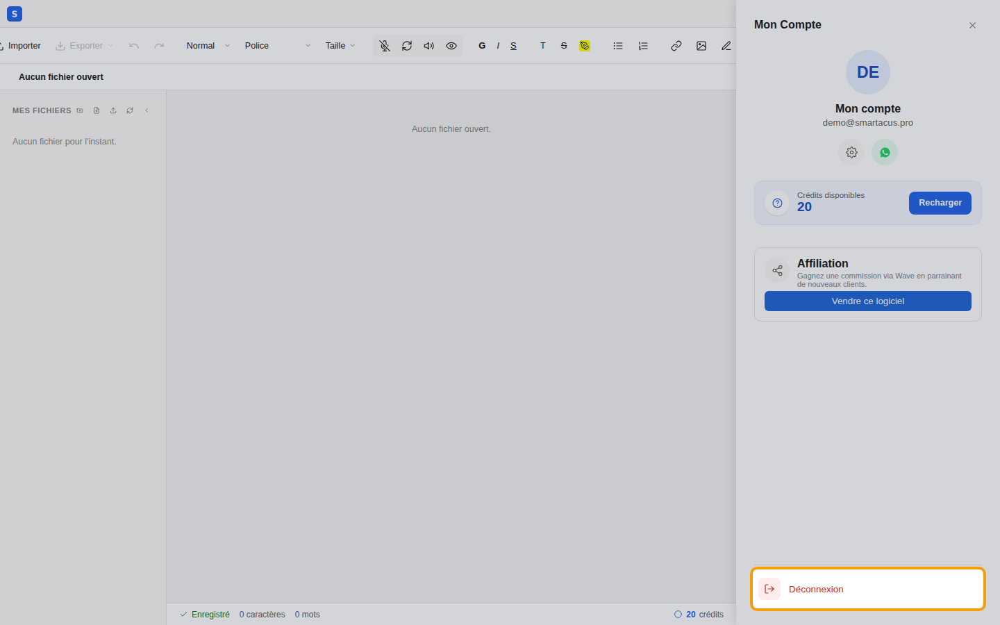
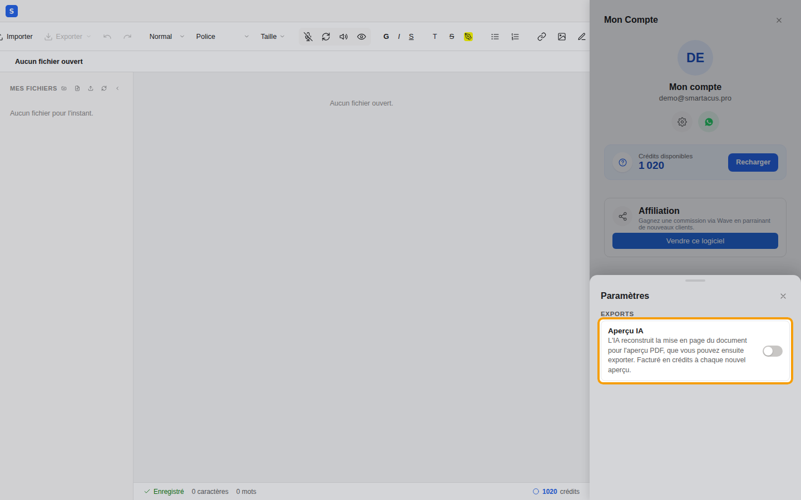
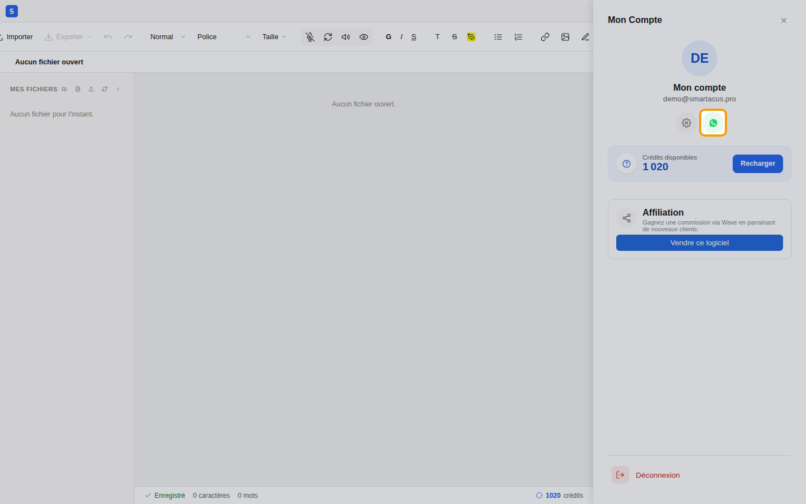

import Clip from "../../../components/Clip.astro";

An account gives you access to your documents and to Copilot, wherever you
are. Open the editor at [odoo.smartacus.pro/editor](https://odoo.smartacus.pro/editor): everything happens in the **Mon compte** (My account) panel, opened with
the icon at the top right of the editor.

## 0.1 Create an account

1. Open **Mon compte**, then click **Se connecter** (Log in).
2. Choose **Créer un compte** (Create an account).
3. Enter your e-mail address and choose a password.
4. Accept the terms of use, then click **Créer mon compte** (Create my
   account).
5. Copy the **6-digit code** you received by e-mail and click **Vérifier**
   (Verify).

<Clip src="en/0-1-creer-un-compte.mp4" caption="Creating an account with an e-mail address" />

:::tip[Can't find the code?]
Check your **spam folder**: that's often where it lands the first time.
:::

You can also use the **Se connecter avec Google** (Sign in with Google)
button: no code or password is needed then.

If someone recommended Smartacus to you, open the editor **from their referral
link** before creating your account: you will be linked to that person.

## 0.2 Log in and log out

To come back later, open **Mon compte**, click **Se connecter** and enter
your e-mail address and password.

Forgot your password? Click **Mot de passe oublié ?** (Forgot password?),
enter your e-mail address and follow the instructions: a code is sent to you
so you can choose a new password.

To log out, for example on a shared computer, click **Déconnexion** (Log
out) at the bottom of the **Mon compte** panel.

## 0.3 Credits and top-ups

The artificial intelligence features use **credits**. Your balance appears in
**Mon compte** (and at the bottom right of the editor). A small welcome bonus
is offered when you sign up.

To top up:

1. Click **Recharger** (Top up).
2. Enter the amount in CFA francs: **1 XOF = 1 credit**.
3. Scan the QR code with the **Wave** app and approve the payment.
4. The top-up is confirmed automatically and your credits are added right
   away.

<Clip src="en/0-3-recharger.mp4" caption="Topping up 1,000 credits with Wave (demonstration QR code)" />

### What uses credits

| Action | Credits |
|---|---|
| Extracting the text of a **scanned** document or a photo | an amount per page, shown before it starts |
| **Régénérer** (Regenerate) a passage | based on the number of words produced |
| **Copilot** changes your document | a small fixed amount per change, plus the number of words written (its chat answers are free) |
| Transcribing a **voice message** | based on the number of words transcribed |
| **Aperçu IA** (AI preview), if enabled | an amount per page of the preview, for each new preview |
| Exporting to **Word (.docx)** | a small fixed amount |

**Free**: dictation, reading aloud, extracting a PDF that already contains
text, reopening a document that was already extracted, the standard preview,
and **PDF** and **image** exports.

:::note[Insufficient balance]
If your balance isn't enough, a message tells you so, with a **Recharger**
button that opens the top-up directly.
:::

## 0.4 Settings

The gear icon in **Mon compte** opens the settings. The **Aperçu IA** (AI
preview) option, off by default, asks the AI to rebuild the layout of your
documents for the PDF preview. It is charged per page for each new preview; without it,
the standard preview is free.

## 0.5 Help on WhatsApp

The **WhatsApp** button in **Mon compte** opens a conversation with Smartacus
support, with a help request already written: all you have to do is describe
your problem.

