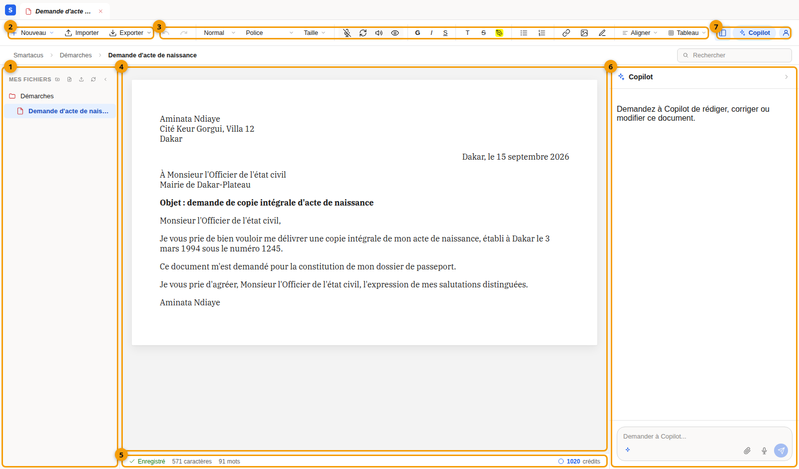

import Clip from "../../../components/Clip.astro";

Open [the editor](https://odoo.smartacus.pro/editor) in Chrome to follow this tour.

## 1.1 Screen tour

1. **Mes fichiers** (My files): your folders and documents. The small buttons
   at the top create a folder or a document, import a file, refresh the list
   or collapse the panel.
2. **Nouveau, Importer, Exporter** (New, Import, Export): create a document,
   import one (PDF, scan, photo), or download the one that is open.
3. **The toolbar**: undo and redo, heading styles, font and size, then the
   voice and AI tools (**Dicter** — Dictate, **Régénérer** — Regenerate,
   **Lire à voix haute** — Read aloud, **Aperçu** — Preview), formatting,
   lists, links, images, alignment and tables.
4. **The page**: your document, which you edit directly as in a word
   processor.
5. **The status bar**: the save status, the number of characters and words,
   and your credit balance.
6. **Copilot**: the assistant that writes and edits the open document (see
   part 3).
7. **The panels**: show or hide **Mes fichiers**, **Copilot** and **Mon
   compte** (My account).

Above the page, the breadcrumb (*Smartacus › Démarches › …*) shows where the
document is, and the **Rechercher** (Search) field filters **Mes fichiers**
by name, including inside collapsed folders.

:::note[Automatic saving]
Your changes are saved automatically: the status bar shows **Enregistré**
(Saved) when everything is up to date.
:::

## 1.2 Folders and documents

1. Click **Nouveau dossier** (New folder) in **Mes fichiers**, type its name
   and press **Enter**.
2. Select that folder, then click **Nouveau fichier** (New file): name the
   document, and it opens straight away in the editor.
3. Hover over a document to show its **Télécharger** (Download), **Renommer**
   (Rename) and **Supprimer** (Delete) buttons.

<Clip src="en/1-2-dossiers-et-documents.mp4" caption="Creating a folder and a document, renaming and deleting them" />

The **Nouveau** menu in the ribbon offers the same choices, and you can also
drag and drop a document into another folder.

:::caution[Permanent deletion]
Deleting a folder or a document asks for confirmation and cannot be undone.
:::

## 1.3 Pages and zoom

The page is shown as sheets of A4 paper, as it will print. In the status bar:

- **Pages / Continu** switches between separate sheets and one continuous
  strip of text (phones open in **Continu**);
- the zoom menu, whose **Ajuster** (Fit) choice fits the sheet to the width of the screen;
- the page counter (*Page 1 sur 3*) follows your position.

Tables break **between rows** and paragraphs **between lines**, so a row is
never cut across two sheets.

## 1.4 Tables

Click **Tableau** (Table) in the toolbar and slide over the grid to pick the
number of rows and columns. Once the cursor is in a table, the same button's
menu offers:

- drag a **column edge** to resize the column, or a **row's bottom edge** to
  change its height; the table always stays within the page;
- select several cells and choose **Fusionner les cellules** (Merge cells), or
  click inside a merged cell and choose **Scinder la cellule** (Split cell);
- **Ligne d'en-tête** (Header row) turns the first row into a header (bold,
  shaded);
- **Égaliser les colonnes** (Even columns) gives every column the same width;
- **Hauteur des lignes : automatique** (Row height: automatic) removes the
  heights you set by dragging.

Column widths and row heights carry over to the PDF and Word exports.

## 1.5 Formulas

Click **Σ** to type a formula in LaTeX (for example `x = \frac{-b}{2a}`); it
appears typeset in the text. To change it, select it then press **Enter** or
double-click.

You can also **paste** formulas: from a web page (Wikipedia, KaTeX or MathML
formulas) or as text between dollar signs (`$E = mc^2$`) they become editable
formulas. When you **copy** a formula, other applications receive its LaTeX
text, and MathML where they accept it.
