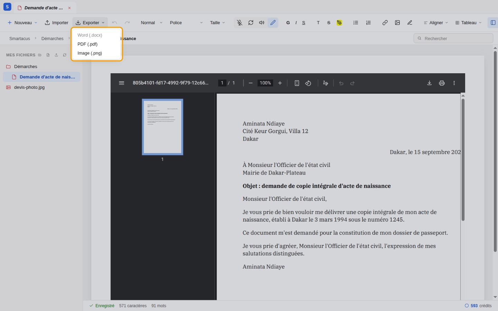
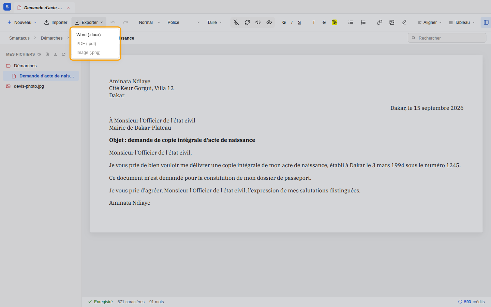

import Clip from "../../../../components/Clip.astro";

## 5.1 Passer en Aperçu

Cliquez sur **Aperçu** (l'œil) dans la barre d'outils : le document s'affiche
tel qu'il sera imprimé, page par page. Cliquez sur **Modifier** (le crayon)
pour reprendre la rédaction.

<Clip src="5-1-apercu.mp4" caption="De la rédaction à l'aperçu, puis retour" />

L'aperçu standard est **gratuit**. L'option **Aperçu IA** (dans les
[paramètres](/fr/editeur/compte/#04-paramètres)) demande à l'intelligence
artificielle de reconstruire la mise en page du document, au plus près de
l'original pour un document importé ; elle est facturée à chaque nouvel
aperçu.

## 5.2 Les deux vues : Original et PDF

Pour un document importé (PDF, scan ou photo), la barre d'état propose deux
vues en mode Aperçu :

- **PDF** : votre version, avec vos modifications ;
- **Original** : le document tel que vous l'avez importé.

<Clip src="5-2-original-et-pdf.mp4" caption="Comparer l'extraction d'une photo avec l'original" />

Passez de l'une à l'autre pour vérifier l'extraction ligne par ligne, en
particulier les montants et les références.

## 5.3 Exporter

Le bouton **Exporter** du ruban propose les formats adaptés au mode en cours :

| Mode | Formats | Crédits |
|---|---|---|
| **Aperçu** | **PDF (.pdf)** et **Image (.png)**, identiques à l'aperçu | gratuit |
| **Modifier** | **Word (.docx)**, pour continuer dans un traitement de texte | un petit montant fixe |

<Clip src="5-3-exporter.mp4" caption="Export en PDF depuis l'aperçu, puis le choix Word en mode Modifier" />

Un format grisé n'est pas disponible dans le mode actuel : survolez-le pour
savoir dans quel mode passer.

:::note[Documents importés]
En mode Aperçu, **Exporter** télécharge directement la version PDF de votre
document (ou le fichier d'origine si aucun aperçu n'a encore été généré). Pour
un export Word, repassez en mode **Modifier**.
:::
