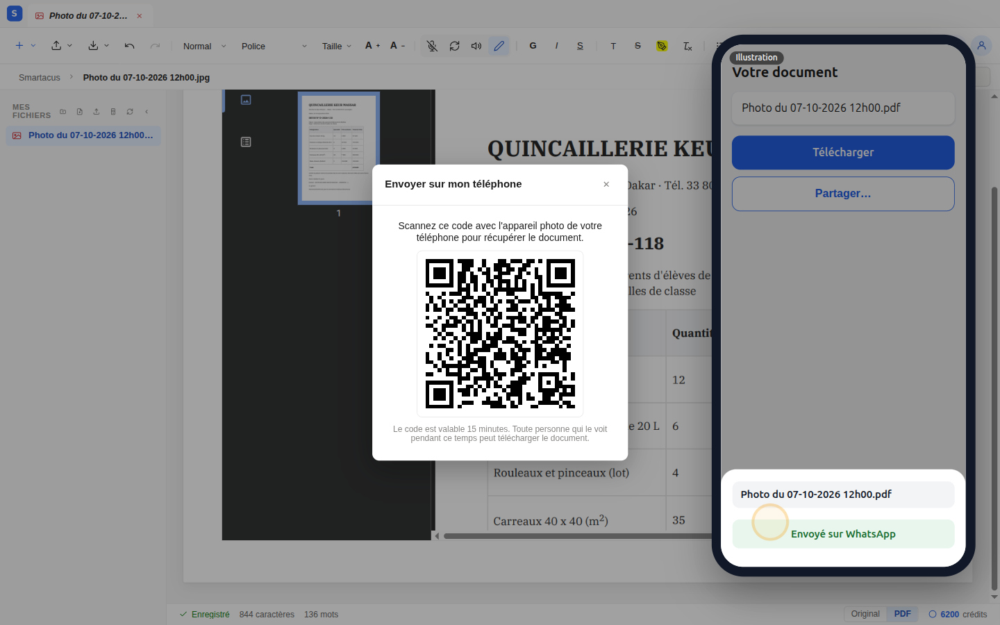

import Clip from "../../../../components/Clip.astro";

Vous avez un document papier (un devis, une facture, un courrier) et votre
téléphone. Sans scanner ni câble, vous le faites entrer dans l'éditeur, vous
le corrigez, puis vous le renvoyez sur votre téléphone pour le partager.

<Clip src="7-du-papier-a-whatsapp.mp4" voice caption="Du papier à WhatsApp, de bout en bout (avec voix off ; attentes accélérées) : lancez la vidéo avec le son" />

:::note[Ce qui est illustré dans la vidéo]
Le téléphone est représenté par un cadre à droite de l'écran. Deux écrans
appartiennent au système du téléphone et non à l'éditeur : **l'appareil
photo** et **le menu de partage**. Ils portent la mention « Illustration » ;
sur votre téléphone, ce sont les vôtres qui s'ouvrent.
:::

## 7.1 Faire entrer le papier

1. Sur l'ordinateur, cliquez sur **Importer**, puis sur **Avec mon
   téléphone** : un QR code s'affiche.
2. Scannez-le avec l'appareil photo de votre téléphone. La page
   **Photographier un document** s'ouvre.
3. Touchez **Photographier une page**, posez le document à plat, bien
   éclairé, et prenez-le en entier. Vous pouvez aussi **choisir dans la
   galerie**, et ajouter plusieurs pages.
4. Touchez **Envoyer** : la page s'ouvre dans l'éditeur, sur l'ordinateur.

## 7.2 Extraire le texte et le corriger

1. Cliquez sur **Modifier**. L'éditeur annonce le nombre de pages et le
   prix : cliquez sur **Extraire**.
2. Si le document porte un cachet, une signature ou un logo, l'éditeur
   propose de les **conserver comme images**, en supplément. Dans la vidéo,
   nous répondons **Non merci** : ils sont alors remplacés par une mention
   entre crochets.
3. Le texte est modifiable, tableau compris. Dans la vidéo, la validité du
   devis passe de 30 à 15 jours.

:::tip[Relisez les chiffres]
L'IA peut se tromper sur un montant ou un nom : vérifiez-les sur le papier
avant d'envoyer le document.
:::

## 7.3 Renvoyer le document sur le téléphone

1. Passez en **Aperçu**, puis cliquez sur **Exporter**.
2. Choisissez **Envoyer sur mon téléphone** : un nouveau QR code s'affiche,
   valable 15 minutes.
3. Scannez-le avec votre téléphone : la page **Votre document** s'ouvre.
4. Touchez **Télécharger** pour garder le PDF, ou **Partager…** pour
   l'envoyer aussitôt par **WhatsApp**, e-mail ou une autre application.

Le bouton **Partager…** apparaît sur les téléphones dont le navigateur
permet le partage de fichiers. S'il n'apparaît pas, téléchargez le document,
puis partagez-le depuis vos fichiers.

Pour aller plus loin : [importer et extraire](/fr/editeur/importer/) et
[aperçu et export](/fr/editeur/apercu/) détaillent chaque étape.
